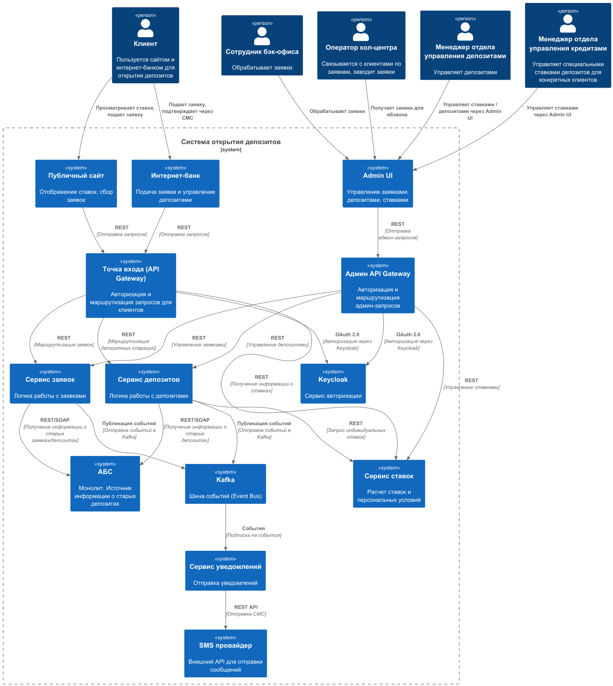
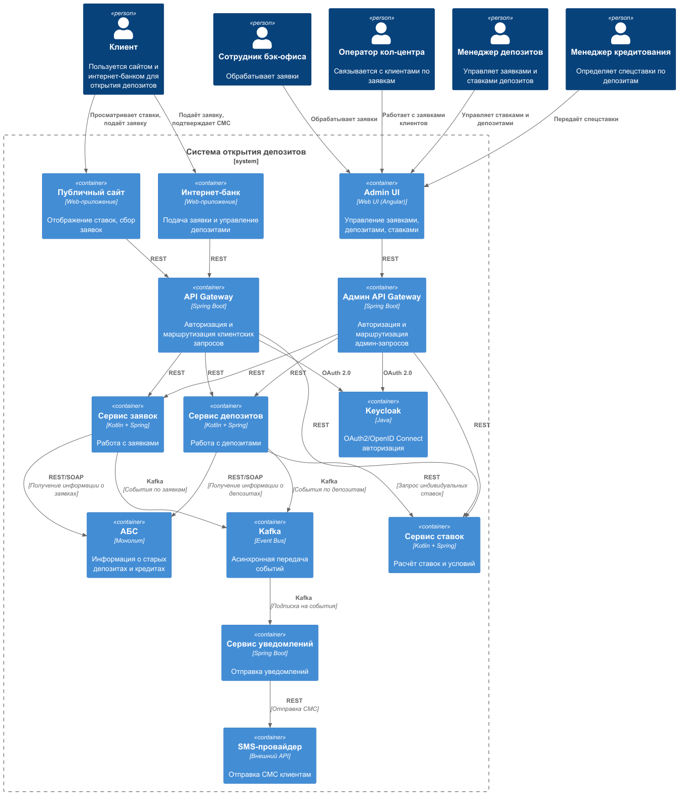

### **Название задачи: MVP открытие депозита**

### **Автор: —**

### **Дата: 12.10.2024**

### **Функциональные требования**

| **№** | **Действующие лица или системы**                                                                               | **Use Case**                                        | **Описание**                                                                                                                                                                                                                                                                                               |
|:-----:|:---------------------------------------------------------------------------------------------------------------|:----------------------------------------------------|:-----------------------------------------------------------------------------------------------------------------------------------------------------------------------------------------------------------------------------------------------------------------------------------------------------------|
|  UC1  | Клиент,   Управление IT,   Управление обслуживанием депозитных продуктов                               | Просмотр текущих процентных ставок с сайта          | 1. Управление депозитных продуктов рассчитывает ставку внутри АБС  2. Клиент видит на сайте ставки на открытие депозита.                                                                                                                                                                               |
|  UC2  | Клиент,   Управление IT,    Управление обслуживанием кредитных продуктов                               | Просмотр текущих процентных ставок в интернет банке | 1. Управление кредитных продуктов рассчитывает ставку внутри АБС  2. Клиент видит в интернет-банке персональные ставки на открытие депозита.                                                                                                                                                           |
|  UC3  | Клиент,   Кол-центр банка «Стандарт»,   Управление обслуживанием в сети отделений,   Управление IT | Подача заявки на открытие депозита с сайта          | 1. Клиент переходит на сайт в офис и заполняет заявку на открытие депозита.  2. Менедежер колцентра перезванивает и предлагает условия  3. Клиент приходит в офис банка для подтверждения своей личности.   4. Менеджер бэк-офиса обрабатывает заявку.   5. Клиент получает СМС с деталями |
|  UC4  | Клиент,   Управление IT                                                                                    | Подача заявки на открытие депозита в интернет банке | 1. Клиент в интернет-банке подаёт заявку на открытие депозита.  2. АБС отправляет СМС клиенту для подтверждения операции.   3. Клиент подтверждает операцию через СМС.  4. Менеджер бэк-офиса обрабатывает заявку.   5. Клиент получает СМС с деталями                                     |

### **Нефункциональные требования**

| **№** | **Требование**                                                                     |
|:-----:|:-----------------------------------------------------------------------------------|
|   U   | Удобство использования (Usability)                                                 |
|  U1   | Использовать существующие дизайн решения и цветовые схемы для новых UI компонентов |
|   R   | Надёжность (Reliability)                                                           |
|  R1   | Режим работы 24/7                                                                  |
|  R2   | Доступность 99.9%                                                                  |
|   P   | Производительность (Performance)                                                   |
|  P1   | Загрузка страниц / подача заявки менее 1с                                          |
|   S   | Поддерживаемость (Supportability)                                                  |
|  S1   | Внедрить в процесс разработки документирование                                     |
|  S2   | По возможности использовать уже существующий стек технологий                       |
|  +R   | + Ограничения (Restrictions)                                                       |
|  +R1  | Шифрования трафика с сайта                                                         |
|  +R2  | Шифрования трафика в интернет-банке                                                |
|  +R3  | Разработать механизм управления ставками и их расчета                              |
|  +R4  | Микросервисная архитектура                                                         |
|  +R5  | Кафка как event-source система                                                     |

### **Решение**

Для обеспечения высокой надежности, в качестве шины событий была выбрана Kafka - она обеспечивает историчность событий,
что позволит повторно отправлять СМС сообщения клиентам об их заявках / депозитах при сбоях у провайдера.

Микросервисная архитектура была выбрана чтобы избежать доработак в ядре АБС и не привлекать стороннего подрядчика, это
позволит также
избежать зависимости при оценке сроков реализации задач. Также такой подход позволит горизонтально масштабировать
необходимые сервисы,
внедрить современные общепризнанные стнадарты аутентификации (oauth2 с сервисом авторизации Keycloak). Микросервисы
позволят иметь несколько инстансов каждого приложения в разных
ЦОД, что позволит нам достичь высокой безотказности и дотупности 99.9%. Плюсом ко всему, современная архтиектура
привлечет опытных разработчиков в команду.

### **Альтернативы**

для MVP можно использовать существующий функционал авторизации. Также объединить функционал работы с депозитами /
ставками / заявками
в одном новом сервисе для ускорения разработки. Также в качестве шины событий можно использовать более простые в
настройке решения, и потом перейти уже на Kafka.
Отправку сообщений можно сделать из этого же сервиса вообще без использования очереди, в целях экономии времени для
запуска MVP

### **Недостатки, ограничения, риски**

Для разработки новой архитектуры не хватает ресурсов разработчиков. В установленные сроки будет достаточным реализации
MVP создание логики
сервисов ставок, заявок и депозиотв в АБС. С другой стороны это может сдвинуть сроки еще дальше, если мы столкнемся с
необходимостью
доработок в ядре.
