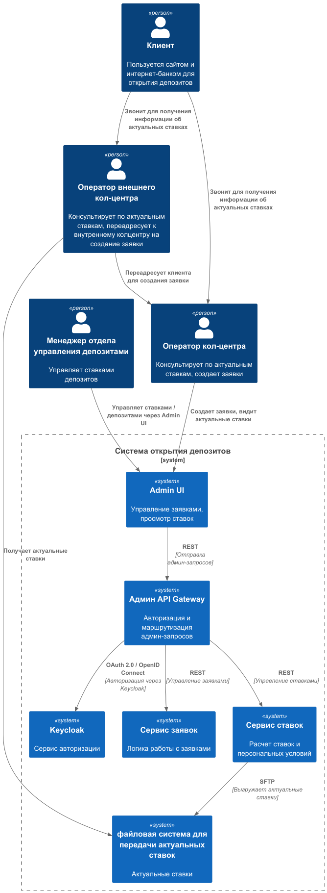
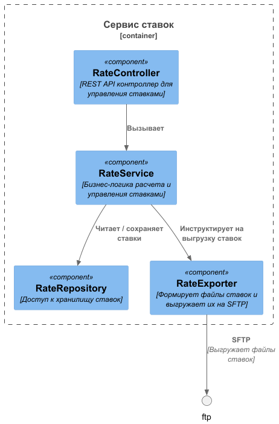

### **Название задачи: Передача ставок в кол-центр**

### **Автор: -**

### **Дата: 12.10.2024**

### **Функциональные требования**

Опишите здесь верхнеуровневые Use Cases. Их нужно оформить в виде таблицы с пошаговым описанием:

| **№** | **Действующие лица или системы**                                                                                           | **Use Case**                                  | **Описание**                                                                                                                                                                                                                   |
|:-----:|:---------------------------------------------------------------------------------------------------------------------------|:----------------------------------------------|:-------------------------------------------------------------------------------------------------------------------------------------------------------------------------------------------------------------------------------|
|  UC1  | Управление обслуживанием депозитных продуктов,   Клиент,   Кол-центр банка «Стандарт»,   Партнёрский кол-центр | Уточнение текущих ставок Клиентом по телефону | 1. Управление по депозитам рассчитывает текущие ставки   2. Клиент звонит в кол-центр для уточнения условий и ставок.   3. Любой из кол-центров полностью обладает информацией о текущих ставках и сообщает их клиенту |

### **Нефункциональные требования**

Опишите здесь нефункциональные требования и архитектурно значимые требования.

| **№** | **Требование**                                                          |
|:-----:|:------------------------------------------------------------------------|
|   1   | Возможность подключения внешнего кол-центра                             |
|   2   | Сотрудники кол-центров обладают актуальными ставками по депозитам       |
|   3   | Внешний кол-центр может принимать актуальные ставки только в виде файла |

### **Решение**

Приведите диаграммы контекста и контейнеров в модели C4. Опишите там основные компоненты и интеграции всех элементов
решения.

Также опишите, какой логикой вы руководствовались в ходе принятия решений и выбора технологий. Не забывайте, что
необходимо учесть все функциональные и нефункциональные требования.

Было решено использовать микросервисныую архитектуру, так как данное разработка в рамках данной задачи поможет для дальнейшего масштабирования системы.
### **Альтернативы**

Опишите здесь наиболее важные альтернативные решения.
Можно использовать вместо FTP сверх надежный подход обмена информацией - EMAIL-RATE-PUBLICATIONS. Это будет требовать минимального количества времени на разработку
со стороны внешнего колцентра. Только назначить ответственное лицо с той стороны, чтоб подтверждал получение ставок.

**Недостатки, ограничения, риски**

Подробно опишите здесь недостатки, ограничения и риски выбранного решения.

Минимальные ограничения, данную архитектуру легко переделать под любой другой формат взаимодействия с внешним кол-центром.