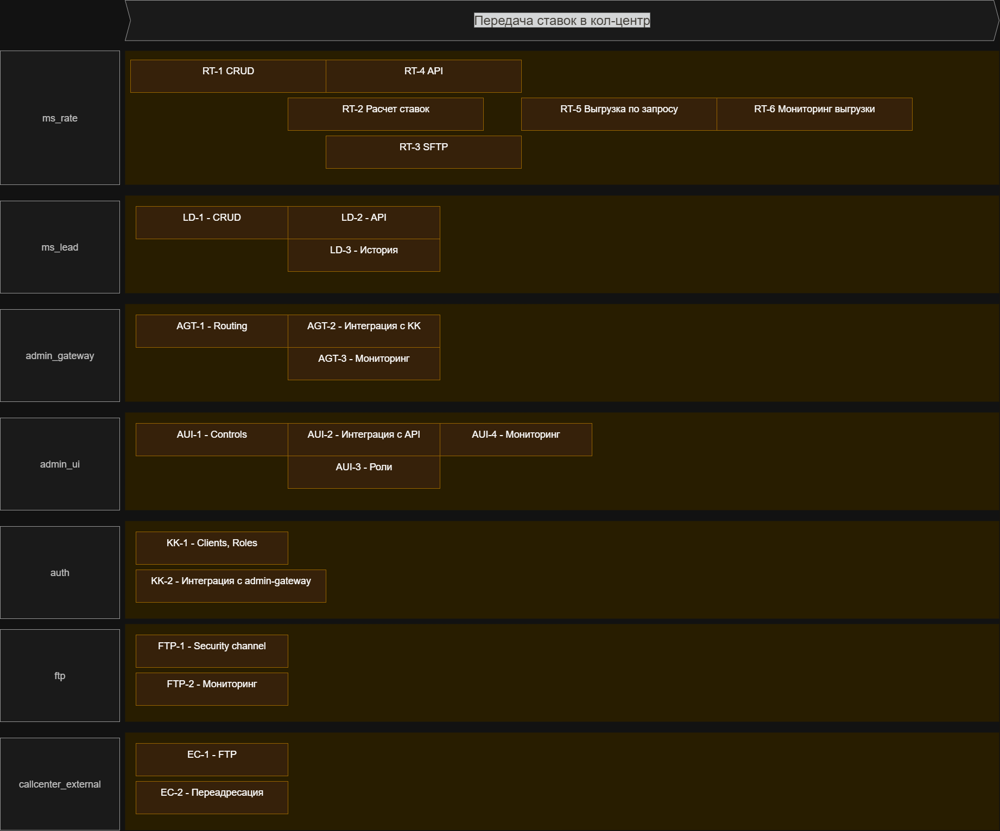

# Крупные задачи для будущего планирования (по системам)

## ms_rate (Сервис ставок)
- RT-1 Хранение и управление актуальными ставками в БД
- RT-2 Реализация расчета ставок на основе бизнес-правил
- RT-3 Формирование файлов с актуальными ставками для передачи во внешний кол-центр (SFTP)
- RT-4 Реализация REST API для получения ставок админкой
- RT-5 Возможность выгрузки ставок по расписанию или по запросу
- RT-6 Мониторинг успешности выгрузки (логи, метрики)

## ms_lead (Сервис заявок)
- LD-1 Создание заявок
- LD-2 API для редактирования и просмотра заявок
- LD-3 История изменений заявок (для контроля обработки)

## admin_ui (Admin UI)
- AUI-1 Просмотр и управление заявками, ставками
- AUI-2 Интеграция с admin API Gateway
- AUI-3 Реализация ролевого разграничения доступа
- AUI-4 Реализация экранов мониторинга выгрузки ставок (успешно / ошибка)

## admin_gateway (Admin API Gateway)
- AGT-1 Реализация маршрутизации запросов к ms_lead, ms_rate
- AGT-2 Подключение к Keycloak для авторизации и аутентификации
- AGT-3 Логирование и трейсинг админ-запросов

## auth (Keycloak)
- KK-1 Настройка ролей и прав для админов, менеджеров депозитов, операторов кол-центра
- KK-2 Интеграция с admin_gateway

## ftp (SFTP / файловая система)
- FTP-1 Настройка защищенного канала передачи файлов с актуальными ставками
- FTP-2 Логирование факта выгрузки и получения файлов

## callcenter_external (внешний кол-центр)
- EC-1 Настройка приема файлов с актуальными ставками по SFTP
- EC-2 Организация переадресации клиента во внутренний кол-центр для создания заявки

